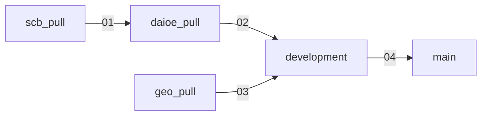

# AI-SCB Year and Regions

AI occupational exposure (DAIOE) merged with Swedish employment data (SCB),
broken down by SSYK2012 occupation, county, sex and year, with county
coordinates for mapping.

- **This branch (`main`)** hosts the published dataset only; the pipeline
  that produces it lives across four upstream branches and `development`,
  described below.
- **Dataset:** `data/daioe_scb_years_all_levels_geo.parquet`, 292,446 rows
  × 72 columns, years 2014–2024, 21 counties.
- **Licence:** CC BY 4.0 (data), MIT (pipeline code) — see "Licensing"
  below.

## Pipeline architecture



| Branch | Role | Build script | Output |
|---|---|---|---|
| `scb_pull` | Pull raw SCB employment tables | `scripts/pull_merge.py`, `scripts/aggregate.py` | `ssyk12_aggregated_ssyk4_to_ssyk1.parquet` |
| `daioe_pull` | Merge DAIOE exposure scores with SCB employment | `main.py` | `daioe_scb_years_all_levels.parquet` |
| `geo_pull` | Maintain county reference coordinates | `main.py` | `county_coordinates.parquet` |
| `development` | Join geo coordinates onto the daioe/SCB dataset | `scripts/merge_geo.py` | `data/daioe_scb_years_all_levels_geo.parquet` |
| `main` | Published dataset only | None | Same file, promoted from `development` |

**Data hand-off:** every stage publishes to the `pipeline-data-latest`
GitHub release and downloads its own inputs from there, rather than
committing data onto a branch (the old approach grew this repo by tens of
megabytes per run, twice a day, from rows that hadn't actually changed).
`development` is the one exception, since `app.py` reads
`data/daioe_scb_years_all_levels_geo.parquet` directly. `04` also
re-publishes the current file under a separate, stable `dataset-latest`
release for external consumers; see "Getting the dataset" below.

**Scheduling:**

- `01` daily at 00:00 UTC, triggers `02` on completion.
- `03` independently, daily at 00:15 UTC.
- `02` and `03` each trigger `04` on completion.
- `04` also runs its own daily schedule (00:30 UTC) as a fallback, and on
  a push to `development`.

All four workflows live only on `main`; each keeps a synced copy of
itself on its source branch, so a direct push to
`scb_pull`/`daioe_pull`/`geo_pull`/`development` still triggers that
stage immediately rather than waiting for the next scheduled run.

**Why `main` lags on non-dataset files:** `04_development_to_main.yml`
promotes only the dataset parquet, not `README.md`, `app.py`,
`_brand.yml` or the dependency files — those stay on `development` while
the app is under active development. Deliberate and temporary; `main`
starts receiving app files again once the app is ready.

## Getting the dataset

The published dataset is available as a GitHub release asset:

```bash
gh release download dataset-latest --repo <owner>/<repo> \
  -p 'daioe_scb_years_all_levels_geo.parquet'
```

`<owner>/<repo>` is this repository's own `owner/name` — run
`gh repo view --json nameWithOwner -q .nameWithOwner` from a clone, or
read it off this page's URL. The same file is also committed at
`data/daioe_scb_years_all_levels_geo.parquet` on this branch, for anyone
who'd rather just read it from a clone.

## Data sources

### Employment counts: Statistics Sweden (SCB)

Pulled from SCB's statistics database (table group `AM0208`, occupational
statistics) via the `pyscbwrapper` API client in
`scb_pull/scripts/pull_merge.py`. Three vintages of the underlying SCB
table are combined, since SCB revised its table ID over time:

| Table code | Years covered |
|---|---|
| `YREG60` | up to 2018 |
| `YREG60N` | 2019–2021 |
| `YREG60BAS` | 2020–2024 |

- Where vintages overlap, the more recent table wins (deduped on
  `code_4` × `county_code` × `sex` × `year`).
- Each row is an employment count for a 4-digit SSYK2012 occupation,
  county, sex (men/women) and year.
- National totals, unspecified-occupation rows and municipality-level
  regions are all dropped; only county-level regions remain.

### AI exposure scores: DAIOE

Sourced from
[`ai-econ-lab/daioe_translations`](https://github.com/ai-econ-lab/daioe_translations)
(`03_translated_files/daioe_ssyk2012_translated.csv`), which translates
occupational AI-exposure scores onto SSYK2012 4-digit codes, one column
per year per AI application/benchmark domain (prefixed `daioe_`):

`allapps` (combined), `stratgames` (strategic games), `videogames`,
`imgrec` (image recognition), `imgcompr` (image comprehension), `imggen`
(image generation), `readcompr` (reading comprehension), `lngmod`
(language modelling), `translat` (translation), `speechrec` (speech
recognition), `genai` (generative AI).

The DAIOE source covers a limited span of years; `daioe_pull/main.py`
extends the series forward to match the latest SCB year by repeating the
last known year's scores unchanged (frozen at their most recent value,
not forecast).

### County coordinates

Compiled manually in `geo_pull/county_coordinates.csv`: one point per
Swedish county (SCB län code `01`–`25`, 21 counties) at that county's
administrative-capital city centre, **not** a computed area centroid.

- Mappings: [SCB, Counties and municipalities in Sweden](https://www.scb.se/en/finding-statistics/regional-statistics/regional-divisions/counties-and-municipalities/),
  cross-checked against Wikipedia's "Counties of Sweden".
- Coordinates: compiled from commonly published city-centre sources
  (Wikipedia, [geodatos.net](https://www.geodatos.net/en/coordinates/sweden)),
  spot-checked August 2026.
- Intentionally approximate, suitable for map markers rather than
  survey-grade geodata; see `geo_pull/README.md` for the full provenance
  note and a pointer to Lantmäteriet if precise centroids are ever
  needed.

## How the merged dataset is built

`daioe_pull/main.py` performs the core merge:

1. Load DAIOE (CSV) and SCB SSYK12-aggregated employment (parquet)
   lazily.
2. Compute 1/3/5-year employment changes per occupation/county/sex
   group.
3. Derive SSYK2012 hierarchy codes (`code_1`…`code_4`) from the 4-digit
   DAIOE occupation code.
4. Extend DAIOE years forward to match SCB's latest year (frozen
   scores, see above), filtered to 2014 onward, the first year of
   SSYK2012 publication.
5. Join DAIOE to SCB SSYK4 employment counts, used as aggregation
   weights.
6. Aggregate DAIOE metrics to all four SSYK2012 levels (SSYK1–SSYK4),
   each with a simple mean and an employment-weighted mean, plus a
   within-year percentile rank.
7. Convert weighted percentile ranks into 1–5 exposure-level buckets
   (quintiles).
8. Left-join onto SCB's employment-change table and export.

`development/scripts/merge_geo.py` then left-joins `county_lat` and
`county_lon` from `county_coordinates.parquet` onto the result,
producing `data/daioe_scb_years_all_levels_geo.parquet`, the file the
Shiny app reads.

## Final dataset schema

`data/daioe_scb_years_all_levels_geo.parquet`: 292,446 rows × 72
columns, years 2014–2024, 21 counties, sex = men/women, `level` ∈
{SSYK1, SSYK2, SSYK3, SSYK4}.

| Column group | Columns | Notes |
|---|---|---|
| Identifiers | `level`, `ssyk_code`, `occupation`, `county_code`, `county`, `sex`, `year` | `ssyk_code` length matches `level` (1–4 digits) |
| Employment | `emp_count`, `chg_1y`/`chg_3y`/`chg_5y`, `pct_chg_1y`/`pct_chg_3y`/`pct_chg_5y`, `weight_sum` | `weight_sum` is a national SSYK4 total, repeated per SSYK code, not county-specific |
| DAIOE (per domain, 11 domains) | `daioe_<domain>_avg`, `daioe_<domain>_wavg` | Simple mean vs. employment-weighted mean across the level's constituent SSYK4 codes |
| DAIOE percentiles | `pctl_daioe_<domain>_avg`, `pctl_daioe_<domain>_wavg` | 0–100, within `year` × `level` |
| DAIOE exposure buckets | `daioe_<domain>_Level_Exposure` | 1 (least exposed)–5 (most exposed), quintiles of the weighted percentile |
| Geography | `county_lat`, `county_lon` | Joined from `county_coordinates.parquet`; see caveats above |

> **Note:** some upstream DAIOE rows carry a literal float `NaN` rather
> than a proper null. Downstream consumers should coerce `NaN → null`
> before aggregating, or weighted averages will silently propagate
> `NaN`.

## Licensing

The published dataset is CC BY 4.0-licensed, matching
`ai-econ-lab/daioe_dataset`; see `development`'s `data/LICENSE`.
Pipeline code is MIT-licensed on `development`; see that branch's
`LICENSE`.

## Repository layout on this branch

```
.github/workflows/   The four pipeline workflows (scheduled + push-triggered)
data/                daioe_scb_years_all_levels_geo.parquet (promoted from
                      development; also published to the dataset-latest
                      release, see above)
```

The Shiny app (`app.py`, `_brand.yml`, `pyproject.toml`, `uv.lock`,
`.python-version`) lives on `development` while it's under active
development and isn't promoted here; see `development`'s README.
