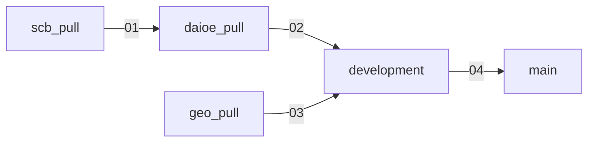

# AI-SCB Year and Regions

AI occupational exposure (DAIOE) merged with Swedish employment data (SCB),
broken down by SSYK2012 occupation, county, sex and year, with county
coordinates attached for mapping. This branch (`development`) is where the
data pipeline and the app are actively developed; the underlying data
pipeline lives across four upstream branches described below.

## About the app on this branch

`app.py` here is currently a **geodata sanity check**, not the analytical
app: it plots one marker per Swedish county, coloured and sized by that
county's latest-year employment-weighted AI exposure, purely to confirm
that `county_lat`/`county_lon` joined onto the dataset correctly. More
substantive app features (occupation drill-down, time series, exposure
comparisons, etc.) are expected to follow; treat the current map as a data
QA tool rather than the final product. The app files here are **not**
promoted to `main` while the app is under active development; see below.

## Pipeline architecture

Data is produced across four branches, each with its own build script and
GitHub Actions workflow, and flows one-way into `development` and then
`main`:



| Branch | Role | Build script | Output |
|---|---|---|---|
| `scb_pull` | Pull raw SCB employment tables | `scripts/pull_merge.py`, `scripts/aggregate.py` | `ssyk12_aggregated_ssyk4_to_ssyk1.parquet`, published to the `pipeline-data-latest` release |
| `daioe_pull` | Merge DAIOE exposure scores with SCB employment | `main.py` | `daioe_scb_years_all_levels.parquet`, published to `pipeline-data-latest` |
| `geo_pull` | Maintain county reference coordinates | `main.py` | `county_coordinates.parquet`, published to `pipeline-data-latest` |
| `development` | Join geo coordinates onto the daioe/SCB dataset | `scripts/merge_geo.py` | `data/daioe_scb_years_all_levels_geo.parquet` (the only generated file still committed here, since `app.py` reads it directly), also published to `pipeline-data-latest` |
| `main` | Published dataset only | None | `data/daioe_scb_years_all_levels_geo.parquet`, and the same file published to the citable `dataset-latest` release |

None of the four stages commit their output onto a branch's git tree
any more, other than this branch's one tracked file above; that was
growing this repo by tens of megabytes per run, twice a day, from rows
that hadn't actually changed. Every stage publishes to a shared
`pipeline-data-latest` GitHub release instead, downloading its own
inputs from there rather than relying on a branch's tree already
having them. The two intermediates this branch's `merge_geo.py` reads,
`daioe_scb_years_all_levels.parquet` and `county_coordinates.parquet`,
are gitignored here for the same reason; for a local run, fetch them
first:

```bash
gh release download pipeline-data-latest --repo <owner>/<repo> \
  -p 'daioe_scb_years_all_levels.parquet' -p 'county_coordinates.parquet' -D data
```

Workflows chain explicitly: `01` (daily 00:00 UTC) triggers `02` on
completion; `02` and `03` (daily 00:15 UTC, independent of the
daioe/scb pull) each trigger `04` on completion. `04` also runs on its
own daily schedule (00:30 UTC) as a fallback, and on a push to this
branch. All four workflows live only on `main`, and each keeps a
synced copy of itself on its own source branch after every run, so
pushing directly to `scb_pull`/`daioe_pull`/`geo_pull`/`development`
(e.g. a script fix) still triggers that stage immediately rather than
waiting for the next scheduled run. **Workflow `04_development_to_main.yml`
promotes only the dataset parquet to `main`, not `README.md`, `app.py`,
`_brand.yml`, or the dependency files.** Those stay on `development` while
the app is under active development; `main`'s README is maintained
independently and describes the dataset only. This is a deliberate,
temporary split: once the app is ready, `main` will start receiving app
files again.

## Data sources

### Employment counts: Statistics Sweden (SCB)

Pulled from SCB's statistics database (table group `AM0208`, occupational
statistics) via the `pyscbwrapper` API client in `scb_pull/scripts/pull_merge.py`.
Three vintages of the underlying SCB table are combined because SCB revised
its table ID over time:

| Table code | Years covered |
|---|---|
| `YREG60` | up to 2018 |
| `YREG60N` | 2019–2021 |
| `YREG60BAS` | 2020–2024 |

Where vintages overlap, rows from the more recent table win (dedup on
`code_4` × `county_code` × `sex` × `year`). Each row is an employment count
for a 4-digit SSYK2012 occupation, county, sex (men/women) and year;
national totals and unspecified-occupation rows are dropped. County-level
(not municipality) regions only.

### AI exposure scores: DAIOE

Sourced from
[`ai-econ-lab/daioe_translations`](https://github.com/ai-econ-lab/daioe_translations)
(`03_translated_files/daioe_ssyk2012_translated.csv`), which translates
occupational AI-exposure scores onto SSYK2012 4-digit codes. Scores are
provided per year and per AI application/benchmark domain (columns prefixed
`daioe_`):

`allapps` (combined), `stratgames` (strategic games), `videogames`,
`imgrec` (image recognition), `imgcompr` (image comprehension), `imggen`
(image generation), `readcompr` (reading comprehension), `lngmod`
(language modelling), `translat` (translation), `speechrec` (speech
recognition), `genai` (generative AI).

The DAIOE source only covers a limited span of years; `daioe_pull/main.py`
extends the series forward to match the latest SCB year by repeating the
last known year's occupation-level scores unchanged (scores are frozen at
their most recent value, not forecast).

### County coordinates

Compiled manually in `geo_pull/county_coordinates.csv`: one point per
Swedish county (SCB län code `01`–`25`, 21 counties) at that county's
administrative-capital city centre, **not** a computed area centroid.
County/capital mappings come from
[SCB, Counties and municipalities in Sweden](https://www.scb.se/en/finding-statistics/regional-statistics/regional-divisions/counties-and-municipalities/),
cross-checked against Wikipedia's "Counties of Sweden"; coordinates were
compiled from commonly published city-centre coordinates (e.g. Wikipedia,
[geodatos.net](https://www.geodatos.net/en/coordinates/sweden)), spot-checked
August 2026. This is intentionally approximate and suitable for map
markers, not survey-grade geodata; see `geo_pull/README.md` for the full
provenance note and a pointer to Lantmäteriet if precise centroids are ever
needed.

## How the merged dataset is built

`daioe_pull/main.py` performs the core merge:

1. Load DAIOE (CSV) and SCB SSYK12-aggregated employment (parquet) lazily.
2. Compute 1/3/5-year employment changes per occupation/county/sex group.
3. Derive SSYK2012 hierarchy codes (`code_1`…`code_4`) from the 4-digit
   DAIOE occupation code.
4. Extend DAIOE years forward to match SCB's latest year (frozen scores,
   see above), filtered to 2014 onward (first year of SSYK2012 publication).
5. Join DAIOE to SCB SSYK4 employment counts, used as aggregation weights.
6. Aggregate DAIOE metrics to all four SSYK2012 levels (SSYK1–SSYK4), each
   with both a simple mean and an employment-weighted mean, plus a
   within-year percentile rank for each metric.
7. Convert weighted percentile ranks into 1–5 exposure-level buckets
   (quintiles) per metric.
8. Left-join onto SCB's employment-change table and export.

`development/scripts/merge_geo.py` then left-joins `county_lat`/`county_lon`
from `county_coordinates.parquet` onto the result, producing
`data/daioe_scb_years_all_levels_geo.parquet`, the file the Shiny app reads.

## Final dataset schema

`data/daioe_scb_years_all_levels_geo.parquet`: 292,446 rows × 72 columns,
years 2014–2024, 21 counties, sex = men/women, `level` ∈
{SSYK1, SSYK2, SSYK3, SSYK4}.

| Column group | Columns | Notes |
|---|---|---|
| Identifiers | `level`, `ssyk_code`, `occupation`, `county_code`, `county`, `sex`, `year` | `ssyk_code` length matches `level` (1–4 digits) |
| Employment | `emp_count`, `chg_1y`/`chg_3y`/`chg_5y`, `pct_chg_1y`/`pct_chg_3y`/`pct_chg_5y`, `weight_sum` | `weight_sum` is a national SSYK4 total, repeated per SSYK code, not county-specific |
| DAIOE (per domain, 11 domains) | `daioe_<domain>_avg`, `daioe_<domain>_wavg` | Simple mean vs. employment-weighted mean across the level's constituent SSYK4 codes |
| DAIOE percentiles | `pctl_daioe_<domain>_avg`, `pctl_daioe_<domain>_wavg` | 0–100, within `year` × `level` |
| DAIOE exposure buckets | `daioe_<domain>_Level_Exposure` | 1 (least exposed) – 5 (most exposed), quintiles of the weighted percentile |
| Geography | `county_lat`, `county_lon` | Joined from `county_coordinates.parquet`; see caveats above |

Note: some upstream DAIOE rows carry a literal float `NaN` rather than a
proper null; downstream consumers (e.g. `app.py`) should coerce
`NaN → null` before aggregating, or weighted averages will silently
propagate `NaN`.

## Running the app locally

```bash
uv sync
uv run shiny run app.py
```

## Licensing

Code (`app.py`, `scripts/`, `_brand.yml`) is MIT-licensed; see `LICENSE`. The
published dataset under `data/` is CC BY 4.0-licensed; see `data/LICENSE`.
This matches the licensing of `ai-econ-lab/daioe_translations` (MIT) and
`ai-econ-lab/daioe_dataset` (CC BY 4.0).

## Repository layout on this branch

```
app.py           Shiny (Python, shiny.express) geodata-check app
_brand.yml       App theming (AI-Econ Lab brand, shared with the org's other apps)
logos/lab.svg    Lab logo used by _brand.yml
LICENSE          MIT (code)
data/            daioe_scb_years_all_levels_geo.parquet (promoted from development)
data/LICENSE     CC BY 4.0 (data)
pyproject.toml, uv.lock, .python-version
```

`_brand.yml` and `logos/lab.svg` are synced automatically from
[`ai-econ-lab/brand`](https://github.com/ai-econ-lab/brand), the lab's
canonical brand source, by `.github/workflows/sync_brand.yml` (daily, and
on demand). Do not hand-edit them here; edit the canonical repo instead,
or the next sync will overwrite local changes.
